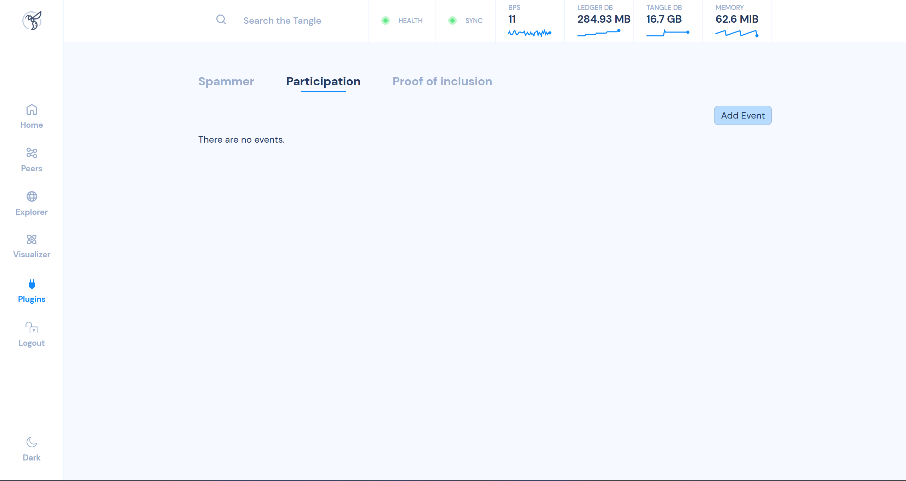

# Participation Events

This repository contains the configurations for participation events IOTA and Shimmer networks.

---

## Current IOTA Event `raw`-links

<b>[IGP - 0002] Tangle Community Treasury Term 2024 to 2025</b>

Link: https://raw.githubusercontent.com/tanglebay/participation/iota-mainnet/templates/0x0a2e8afc01146f6283233e7d69fbd1a7455078f239fd33a22c05bf2c529ed633.json

ID: `0x0a2e8afc01146f6283233e7d69fbd1a7455078f239fd33a22c05bf2c529ed633`

<b>[IGP - 0003] Tangle Community Grant Committee Reviewer selection</b>

Link: https://raw.githubusercontent.com/tanglebay/participation/iota-mainnet/templates/0x91ca895ef442d3266537fa5e73736bc774bea2571a85fbf4451d44c236311a5c.json

ID: `0x91ca895ef442d3266537fa5e73736bc774bea2571a85fbf4451d44c236311a5c`

<b>[IGP - 0004] Tangle Community Grant Committee - Lead selection</b>

Link: https://raw.githubusercontent.com/tanglebay/participation/iota-mainnet/templates/0xcd46807cf026c9eab7245bb9d11f51ae4c60fde2f1bed830520beb14adba412a.json

ID: `0xcd46807cf026c9eab7245bb9d11f51ae4c60fde2f1bed830520beb14adba412a`

## Current Shimmer Event `raw`-links

<b>[SGP - 0007] Tangle Community Treasury Term 2024 to 2025</b>

Link: https://raw.githubusercontent.com/tanglebay/participation/iota-mainnet/templates/0x69194943b788eb67bfd3b1e258041af1cbb8f501489c5d826e6cd970cfaf01eb.json

ID: `0x69194943b788eb67bfd3b1e258041af1cbb8f501489c5d826e6cd970cfaf01eb`

<b>[SGP - 0008] Tangle Community Grant Committee Reviewer selection</b>

Link: https://raw.githubusercontent.com/tanglebay/participation/shimmer-mainnet/templates/0xf537ce0f5f18726057342f9c66ce69da242f827a7b712e466a5ba56acf7b6b55.json

ID: `0xf537ce0f5f18726057342f9c66ce69da242f827a7b712e466a5ba56acf7b6b55`

<b>[SGP - 0009] Tangle Community Grant Committee - Lead selection</b>

Link: https://raw.githubusercontent.com/tanglebay/participation/shimmer-mainnet/templates/0x32dd81b45c36c67f5d1d9b218d023aa3a658f17c485caeb8300e6f5b9136b91c.json

ID: `0x32dd81b45c36c67f5d1d9b218d023aa3a658f17c485caeb8300e6f5b9136b91c`

---

## How to add a ballot or staking event as a node operator?

These steps are identical for Shimmer and IOTA Hornet Nodes.

### Add event via node dashboard

After starting your node, you can open the node dashboard and navigate to `Plugins`. 
If the Participation plugin has been successfully enabled, you should see a new option called `Participation`.

Click on `Participation` to enter the plugin settings.

In the top right corner, click `Add Event`. 
Now you can paste the `raw`-link to the event configuration file.

After clicking `OK`, the new event is shown (if everything was entered correctly).

Your node is now ready to track the specific participation event. You can view the current status of the event by clicking on `More details`.
